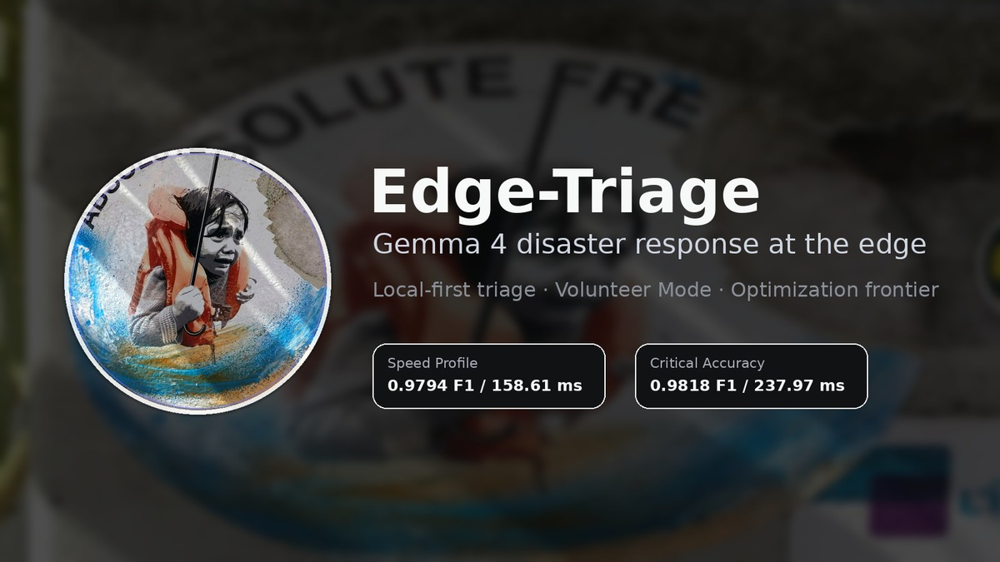

# Edge-Triage: Gemma 4 Multimodal Disaster Searcher



Edge-Triage is a local-first disaster triage system for the **Gemma 4 Good Hackathon**. It helps volunteers classify disaster reports from text and images on edge hardware, while data science teams use the same evaluation harness to keep improving the speed/accuracy frontier.

## What problem does it solve?

In a flood, wildfire, earthquake, or hurricane, responders receive messy reports from many sources: short text messages, photos, voice notes, social posts, and volunteer observations. Connectivity may be unreliable exactly when the report volume is highest.

Edge-Triage gives a field team a practical local tool:

1. A volunteer enters a short report, optionally with a photo.
2. Gemma 4 classifies the scene into a humanitarian triage category.
3. The app shows priority, confidence context, latency, and a conservative next action.
4. The responder keeps human control. Edge-Triage routes and explains; it does not replace incident command or medical professionals.

The project also gives a data science team a repeatable way to improve the system after new disaster data arrives:

1. Drop new MEDIC/QCRI-style shards or image/report samples into the workspace.
2. Run `triage_sandbox.py` against the 50-sample gold set.
3. Record F1, latency, VRAM, routing mix, state hash, and keep/discard status in `results.tsv`.
4. Compare new runs against the current frontier in `docs/CURRENT_FRONTIER.md`.
5. Keep changes only when they improve triage quality without breaking the field latency budget.

That split is the whole product: simple for volunteers, measurable for researchers.

The self-improving research loop is inspired by Andrej Karpathy's AutoResearch-style pattern: a fixed benchmark harness, an agent-editable sandbox, and a measured keep/discard rule. In Edge-Triage, that idea is adapted for NGO/humanitarian use through the templates in [`agents/`](agents/), with human review before deployment defaults change.

## Judge-facing experiences and model profiles

Edge-Triage has two public Web UI experiences:

- **Volunteer Mode:** the field-facing workflow for high-volume sorting. This is what a volunteer would use during an incident.
- **Optimization Mode:** the research cockpit showing autonomous experiments, keep/discard decisions, and the Pareto frontier. This is what a data science or response lead uses to understand why a profile was chosen.

Behind those experiences are two validated model profiles:

- **Volunteer Speed Profile:** optimized for fast routing when many reports arrive at once.
- **Critical Accuracy Profile:** optimized for high-stakes review, such as possible casualties, blocked evacuation routes, or other ambiguous reports where a small latency tradeoff is acceptable. It is not a third top-level UI mode; it appears in the metrics/frontier evidence so teams know when to choose the more careful profile.

The curated offline demo in `site/` works without a hosted model so judges always have a reliable path. It does not call the model or show upload controls; judges click fixed public-safe scenario cards and the UI updates the related image, label, priority, next action, and analysis. The optional Live Gemma preview can call the guarded Gemma 4 API for uploaded images through the public site, without requiring judges to paste a token.

## Current frontier

The competition-facing source of truth is [`docs/CURRENT_FRONTIER.md`](docs/CURRENT_FRONTIER.md). Use that file when updating public claims, the demo site, or the video script.

| Profile | Use case | F1 | Accuracy | Latency | Samples | Run |
| --- | --- | ---: | ---: | ---: | ---: | --- |
| Volunteer Speed Profile | High-volume field sorting | 0.9794 | see run log | 158.61 ms | 50 | EDG-307 r0 / `20260427T200056Z` |
| Critical Accuracy Profile | High-stakes review | 0.9818 | 0.9800 | 237.97 ms | 50 | EDG-480 r2 / `20260515T093558Z` |

Both profiles are far below the 4-second field-response budget. Older figures such as 65%, 71.5%, and 90.52% are historical milestones from earlier submission-era or ledger states, not the current frontier.

## How the pieces fit

```text
Field volunteer                  Data science / response lead
      |                                      |
      v                                      v
site/ or edge-triage-cli.py       triage_sandbox.py
      |                                      |
      v                                      v
Gemma 4 local triage              gold-set evaluation + results.tsv
      |                                      |
      v                                      v
label + priority + action         keep/discard frontier decision
```

Main artifacts:

- `site/` — curated offline demo with Volunteer Mode, Optimization Mode, and readable metrics.
- `live_api.py` — optional guarded Live Gemma preview for uploaded images.
- `edge-triage-cli.py` — local field CLI for text/image/audio-style reports.
- `triage_sandbox.py` — research and evaluation harness.
- `results.tsv` — experiment ledger.
- `docs/CURRENT_FRONTIER.md` — canonical public metric summary.
- `docs/superpowers/research_logs/` — public research trail for the AutoResearch/EDG experiment loop.
- `media/` — public-safe screenshots and source media for Kaggle/video.
- `data/` and `logs/` — placeholder workspaces for local shards, extracted images, and generated benchmark logs; generated contents stay ignored.
- `submission_notebook.ipynb`, `analysis.ipynb`, and `kaggle_dataset_upload/` — Kaggle packaging and research-ledger notebook assets.
- `agents/` — optional templates for Paperclip-style NGO/research workspaces that want an agentic AutoResearch loop around `triage_sandbox.py`.
- `plugin/` — optional Paperclip dashboard skeleton for viewing `results.tsv` and triggering trusted local benchmark pulses.
- `infra/` — optional local Paperclip stack example. The public judge demo does not require it.
- `Modelfile` and `litert_backend.py` — Ollama and LiteRT/Google AI Edge deployment scaffolds.

## Quick start

These commands are first-clone smoke checks. They do **not** need the multi-GB model/data downloads because they run tests, help screens, and the static judge site.

```bash
# Install dependencies
uv sync

# Run unit tests
uv run python -m unittest discover tests/

# Try the field CLI help
uv run python edge-triage-cli.py --help

# Run the research sandbox help
uv run python triage_sandbox.py --help

# Serve the static judge site locally
python3 -m http.server 4173 --directory site
# then open http://127.0.0.1:4173
```

To run real local model inference or a full research benchmark, prepare the model/data artifacts first:

```bash
# Hugging Face auth may be required for gated model/data access.
uv run huggingface-cli login

# Download/prepare GGUF model artifacts and local benchmark assets.
uv run prepare.py
uv run local_extractor.py

# Then run the field CLI or benchmark with real artifacts.
uv run python edge-triage-cli.py --report "Bridge damaged after flood; two families waiting near school."
uv run python triage_sandbox.py
```

For a safer public-style static site container:

```bash
docker compose up -d --build
curl -I http://127.0.0.1:4173/
curl -fsS http://127.0.0.1:4173/data.json >/dev/null
```

## Documentation map

Start here if you are new:

- [`docs/CURRENT_FRONTIER.md`](docs/CURRENT_FRONTIER.md) — current trusted metrics and how to talk about them.
- [`docs/KAGGLE_SUBMISSION.md`](docs/KAGGLE_SUBMISSION.md) — submission narrative and artifact checklist.
- [`docs/KAGGLE_WRITEUP.md`](docs/KAGGLE_WRITEUP.md) — paste-ready Kaggle writeup draft.
- [`docs/superpowers/research_logs/README.md`](docs/superpowers/research_logs/README.md) — public EDG research logs and AutoResearch audit trail.
- [`docs/DEPLOYMENT.md`](docs/DEPLOYMENT.md) — public demo hosting, Docker, HTTPS, and live-preview safety controls.
- [`docs/ARCHITECTURE.md`](docs/ARCHITECTURE.md) — system design and research loop.
- [`docs/DEVELOPER_GUIDE.md`](docs/DEVELOPER_GUIDE.md) — setup, data/model prep, and experiment workflow.
- [`agents/README.md`](agents/README.md) — optional Paperclip-style agent templates for self-improving NGO/research workflows.
- [`plugin/README.md`](plugin/README.md) — optional local Paperclip dashboard skeleton.
- [`infra/README.md`](infra/README.md) — optional local Paperclip stack example.
- [`data/README.md`](data/README.md) and [`logs/README.md`](logs/README.md) — local workspace placeholders and ignore policy.
- [`docs/OPERATIONS_GUIDE.md`](docs/OPERATIONS_GUIDE.md) — field-operator CLI usage.
- [`site/README.md`](site/README.md) — judge demo site notes.
- [`media/README.md`](media/README.md) — screenshot and video media library.

## Why it matters

- **Offline privacy:** sensitive disaster data can be processed locally.
- **Speed:** the default field profile is measured in hundreds of milliseconds in the validated benchmark, not seconds.
- **Safety:** outputs are constrained to triage labels and conservative next actions, not unsupported medical advice.
- **Adaptability:** the optimization loop can re-evaluate new crisis data and expose the accuracy/latency frontier.

---

Benchmark-driven development for local-first disaster triage.

Gemma is a trademark of Google LLC.
